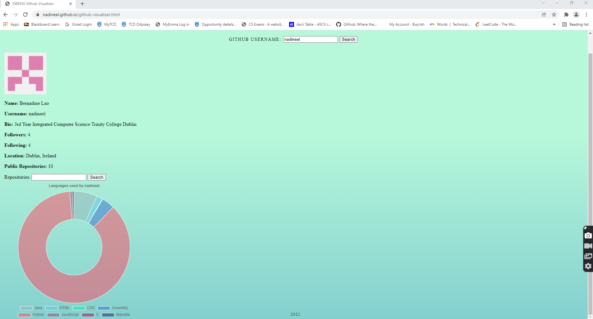
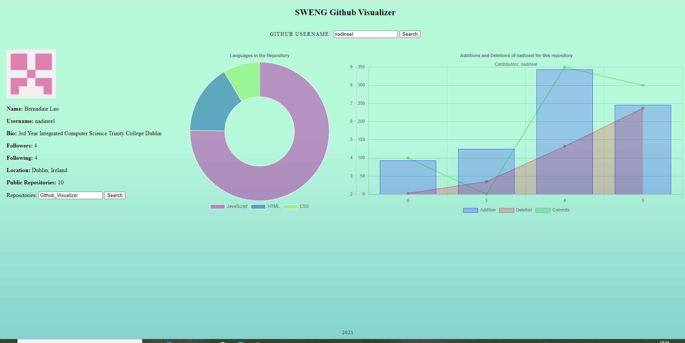

# Github_Visualizer

Visualising Github accounts' data pulled using documents from **[GitHub REST API](https://docs.github.com/en/rest)** with **[Chart.js](https://www.chartjs.org/)** library.

## To Note

Languages used:
* JavaScript
* HTML
* CSS

Use of Github Authentication token is recommended for less restricted access. It SHOULD NOT be pushed onto Github for other users to see. 
Place the token in data.js --> getRequest().  

## Running the Project

To run the project in your machine,  **Docker** should be installed. 

Create a directory on your machine
```mkdir <name>```\
Clone the repository onto the directory created.

Pull nginx image \
```docker run --name website -v %cd%:/usr/share/nginx/html -d -p 8080:80 nginx``` (Windows)\
```docker run --name website -v $(pwd):/usr/share/nginx/html -d -p 8080:80 nginx``` (Linux)\
(eg. name=website)

To visit the webpage: ```localhost:8080```

<ins>OR</ins>

Visit my website to access the project online
**[GitHub Visualizer](https://nadineel.github.io/github-visualiser.html)**

## Demo


The landing page asks for a Github username. It will then display the users general info and remove the category if it is empty. (ie. If Location is null, Location is then removed on the side bar.) \
Below that is an interactive Search Bar to navigate through the user's public repositries. And finally, There is a doughnut chart that displays the language(s) used by the user across their repositories. \


This screenshot displays my overall activity for this project's repository. \
The doughnut chart displays the languages I used in this project and how much each takes up. The graph on the right pane displays my interaction with the project. It also shows the contributors on the repository. The x-axis shows the weeks the user has had any commit, deletion, or addition starting from when it was created (Week 0). Notice that 1 and 2 are missing. It is because there was no activity during those weeks hence, I dicided to leave them out.


Here is a demonstration of me navigating through different repositories from my account. It will also work for different Github accounts. 


## Reflection

This project uses JavaScript for its backend and HTML and CSS for the front end. I chose these languages because I have had little experience of them and I wanted to take the opportunity to learn how to use it more. \
On the otherhand, GitHub API Docs and Chart.js are two components of the project that I was not aware of beforehand. It took me awhile to get started because I was struggling to decide what I want to showcase and how I should implement.

At the beginning, I constantly forget to commit my changes in the repository but as I kept working on it, I commit changes every so often as I found the need to constantly return to the previous version of my repository after some unsuccessful attempts to progress with the project. Overall, this assignment definitely improved my skills as a programmer and coding it has been great and satisfying especially when things started going my way. Of course, there is still a room for improvement. For example, if a repository has alot of contributors or it has alot of activity, the data labels become distorted and that is something I recently found out when testing it out. 


